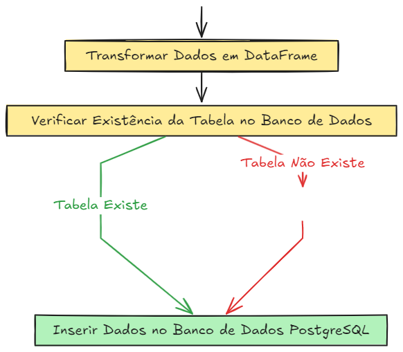

# Projeto de Data Warehouse de Commodities

Este projeto foi desenvolvido para exercitar os conhecimentos relaciondos a criação de  um simples Data Warehouse (DW) para armazenar e analisar dados de commodities, utilizando uma arquitetura moderna de ETL (Extract, Transform, Load). 

Projeto desenvolvido possuí muitas alterações em relação ao original, visando exercitar alguns conhecimento e para melhorar o fluxo; conferindo ao fluxo do projeto um controle maior das interações com banco postgreSQL

O projeto inclui:

1. **Configura github SSH** 

    ***1.1*** No terminal criei minha chave SSH:

        sh ssh-keygen -f ~/.ssh/rafaelamorim_rsa -t rsa -b 4096

    ***1.2*** Exibi a minha chave pública criada:

        cat ~/.ssh/rafaelamorim_rsa.pub

    ***1.3*** Iniciar o 'Agente SSH':

        eval "$(ssh-agent -s)"

    ***1.4*** Especificando a chave SSH a ser utilizada:

        ssh-add ~/.ssh/rafaelamorim_rsa

    ***1.5*** Testando a conexão:

        ssh -T git@github.com

    ***1.6*** Push do primeiro commit

        git push -u origin main


2. **Criar o Banco PostreSQL [Docker]** 

    ***2.1 -*** Criei um arquivo docker-compose.yaml com as instruções para levantar um container da imagem Postgres: "postgres:17rc1-alpine3.19".

    ***2.2 -*** Conforme a documentação disponível no site [Docker Hub](https://hub.docker.com/_/postgres) explorei a criação de database, senha e schemas através das variáveis de ambiente da imagem.

    ***2.3 -*** Com o comando ```docker compose up -d --build``` levantei o container; para testar, estabeleci conexão através do Dbeaver.

3. **Parte de Extract_Load** 

    ***3.1 -*** Utilizando um script Python responsável por extrair dados da API yfinance

    ***3.2 -*** Criar função para interação com banco Postgres para checkar a existência da tabela commodities

    ***3.3 -*** Utilizando 'Reflexting' do sqlalchemy fiz a checagem da existência da tabela, caso já exista, chamada a função para inserção dos dados, caso contrário a tabela criada e na sequência chamamos a função para inserção de dados

4. **Models**: Define as transformações de dados usando DBT, criando tabelas de staging e delas criando datamart's, explorando a arquitetura de projetos dbt e os principais conceitos da ferramenta.

5. **Seed [Dados estáticos]**: Utiliza seeds do DBT para carregar dados de movimentações de commodities a partir de arquivos CSV.


## Gráficos Mermaid

### Fluxo do ETL



